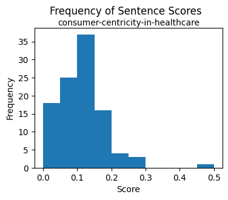
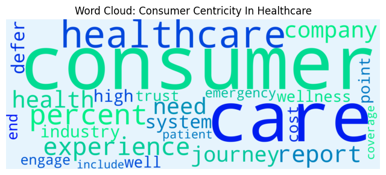
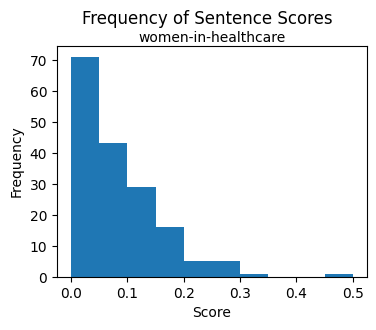
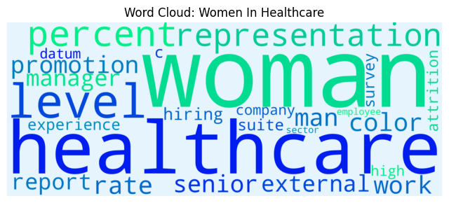

# Web Scraping & NLP   
- Description: Scraping text from websites for Natural Language Processing
- Created: 5/10/23  

## Overview:
- This code scrapes text from two websites and performs natural language processing (NLP) tasks for sentiment analysis and summarization   
- Web scraping is accomplished using <a href="https://beautiful-soup-4.readthedocs.io/en/latest/" target="_blank">Beautiful Soup</a>, a Python library for pulling data out of HTML and XML files
- NLP tasks are done with <a href="https://spacy.io/" target="_blank">SpaCy</a>, an open-sourced Python library of NLP tools 

## Files & Links:
- Jupyter Notebook: [web_scraping_nlp.ipynb](web_scraping_nlp.ipynb)
- Scraped Websites:  
    - <a href="https://www.mckinsey.com/industries/healthcare/our-insights/driving-growth-through-consumer-centricity-in-healthcare" target="_blank">Consumer Centricity in Healthcare</a>
    - <a href="https://www.mckinsey.com/industries/healthcare/our-insights/women-in-healthcare-and-life-sciences-the-ongoing-stress-of-covid-19" target="_blank">Women in Healthcare</a>
- Scraped Text:  
    - [scraped-consumer-centricity-in-healthcare.html](scraped-consumer-centricity-in-healthcare.html) 
    - [scraped-women-in-healthcare.html](scraped-women-in-healthcare.html) 
- Summarized Text:   
    - [summary-consumer-centricity-in-healthcare.txt](summary-consumer-centricity-in-healthcare.txt)
    - [summary-women-in-healthcare.txt](summary-women-in-healthcare.txt) 

## Setup  
Required Libraries:  
- request, beautifulsoup, spacy, spacytextblob, collections, matplotlib, wordcloud, re, numpy

Documentation:  
- SpaCy: https://spacy.io/  
- Beautiful Soup: https://beautiful-soup-4.readthedocs.io/en/latest/  

## Process:  
1. Scrape Text Content

2. Create Sentiment Analysis Function

3. Create Summarization Functions

4. Run the Program

## Results  

### Consumer Centricity in Healthcare

Polarity:  
- This article's sentiment was slightly positive with a score of 0.15

Most Frequent Lemmas:
1. Consumer: appeared 95 times
2. Care: appeared 81 times
3. Healthcare: appeared 62 times
4. Experience: appeared 23 times
5. Report: appeared 21 times
  

Summary:
- This article was summarized into 10 sentences containing key concepts
- This article discusses the steps along the healthcare journey and the adverse consequences that result when consumers defer care because of poor healthcare experiences. Care deferral has serious consequences for consumers and health systems Given the challenges of navigating todays healthcare journeys, it is no wonder that nearly a quarter of US consumers have reported deferring healthcare. Negative experiences simply reinforce the cycle of care deferral. Bolstering consumer trust in the healthcare system could encourage more consumers to seek needed care. Likewise, bolstering consumer trust in the healthcare system could encourage more consumers to seek needed care. Addressing consumer pain points can unlock better outcomes satisfied consumers report deferring care ten percentage points less, getting routine care 14 percentage points more, and using inpatient care 13 percentage points less than unsatisfied consumers. Ultimately, consumer health improves. Understand consumers. Second, consumers want meaningful, trust-based relationships with their care teams. Six times more consumers with longitudinal-care-team relationships and care continuity report engaging with their primary care physician for future health needs.

### Women in Healthcare

Polarity:  
- This article's sentiment was slightly positive with a score of 0.10

Most Frequent Lemmas:
1. Woman: appeared 118 times
2. Healthcare: appeared 74 times
3. Level: appeared 62 times
4. Representation: appeared 46 times
5. Rate: appeared 26 times

Summary:
- This article was summarized into 17 sentences containing key concepts
- Representation Healthcare continues to outpace other industries in the representation of women however, women especially women of color remain underrepresented at senior levels in healthcare organizations Exhibit 1. Increased representation. At all levels, womens representation in healthcare remains higher than in corporate America overall. Lack of representation in senior levels. But the representation of women drops in each successive career level to a low of 32 percent at the C-suite level. Women in senior-level roles in healthcare are predominantly White. Attrition Higher rates of attrition. Promotions Lower promotion rates. Internal promotion rates for women in healthcare are lower than the average for women in all industries at every level. Healthcare companies can keep a critical eye on the ratio of womens representation at a given level and the share of women hired into that level. Women continue to have higher levels of representation, hiring, and advancement in healthcare than in corporate America overall. The healthcare sector is examining how to better hire and promote women to the highest levels. We identified three important shifts in 2021 increased representation of women at specific managerial levels, lower rates of attrition among women in healthcare than in other sectors, and increased external hiring of women at specific levels of the pipeline.   Increased representation In healthcare, the representation of women at the senior-manager or director level improved by four percentage points on average, to 53 percent, in 2021. Lower rates of attrition On average, in 2021 women left jobs in healthcare at lower rates than women in other sectors, men in healthcare, and women in healthcare in previous years. This effect can compound over time, resulting in lower representation for women at the highest levels. Gender parity and proportionate representation of women of color in healthcare at the top levels remains aspirational.

   
   
   
   
   
      

